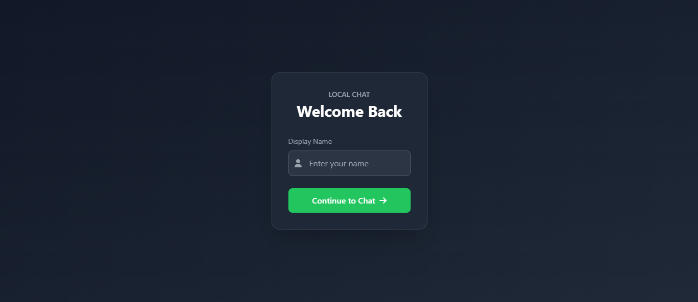
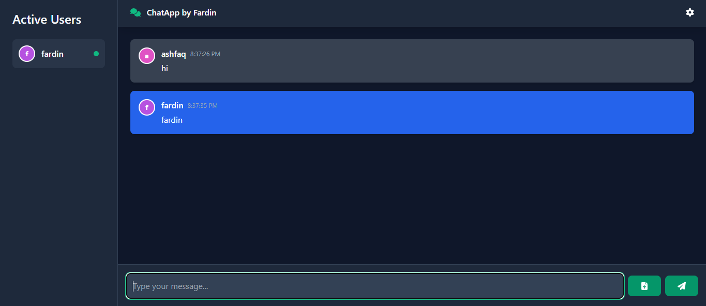

Here's the updated documentation with your additional information:

# **Local Chat Application**

A real-time chat application with seamless local network communication, built using modern web technologies.

## 🚀 Features

✅ Real-time messaging  
✅ User presence detection  
✅ File sharing support  
✅ Responsive design  
✅ Local network communication  
✅ Custom user avatars  
✅ Message notifications

## 🛠️ Prerequisites

Ensure you have the following installed on your system:

- **Node.js** (LTS version recommended)
- **npm** (comes with Node.js)
- **Git Bash** (for running shell scripts)

## 📦 Installation

### **Clone the Repository**

1. **Open Terminal or Git Bash**
2. **Run the following command:**
   ```bash
   git clone <repository-url>
   cd local-chat-app
   ```

### **Install Backend Dependencies**

```bash
cd backend
npm install
```

### **Install Frontend Dependencies**

```bash
cd ../frontend
npm install
```

## 🎯 Getting Started

Run the application using the provided script:

```bash
./start-app.sh
```

### **The application will start at:**

- **Frontend:** [http://localhost:3000](http://localhost:3000)
- **Backend:** [http://localhost:5000](http://localhost:5000)

## 💻 Tech Stack

### **Frontend**

- React with TypeScript
- Socket.IO Client
- Tailwind CSS
- FontAwesome Icons

### **Backend**

- Node.js
- Express
- Socket.IO
- CORS

## 📸 Screenshots

### **Login Page**



### **Chat Page**



---

## 👨‍💻 Development Scripts

Frontend scripts available in `package.json`:

- `npm start` – Runs the frontend in development mode.
- `npm run build` – Builds the frontend for production.

---

## 🤝 Contributing

We welcome contributions! To contribute:

1. **Fork the repository**
2. **Create your feature branch** (`git checkout -b feature-name`)
3. **Commit your changes** (`git commit -m "Add new feature"`)
4. **Push to the branch** (`git push origin feature-name`)
5. **Open a Pull Request**

---

## ⚖️ License

This project is **MIT licensed**.

## 👤 Author

**Ashfaq Fardin**  
[LinkedIn](https://linkedin.com/in/ashfaqfardin)
